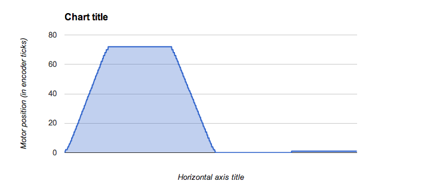
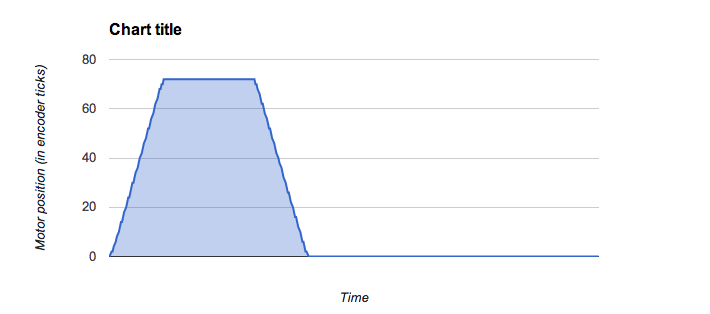
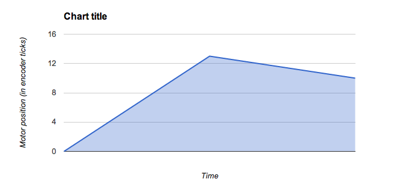

SENG 5831 - Lab 2
=================

Christian Dinger
----------------

1. Experiment with the speed of the motor: Run your motor at full speed. Modify your gains to achieve position control at that speed (as best you can). Slow the motor down as much as possible. Modify your gains to acheive position control. Repeat with one or two speeds in between. For each, record the approximate speed in rotations per second, record your equation (gains), and report on the behavior of the system and your ability to control the position.

Full speed (F=1000 S=45 Kd=1/10 Kp=30 Vm=0 Pr=72 Pm=72 T=0)
---

With these gains, the maximum motor torque is 249, very close to the
physical maximum of 255. At this high speed, there is a slight
overshoot/oscillation at the end of the full trajectory.

Slow speed (F=1000 S=45 Kd=1/10 Kp=5 Vm=9 Pr=72 Pm=70 T=10)
---

These lower gains produced a maximum torque value of 42. The speed of
the motor was obviously much slower, but there was no overshoot of the
final target; as the motor approached the target is slowed smoothly to a
stop.

Mid-slow speed (F=1000 S=45 Kd=1/10 Kp=12 Vm=0 Pr=72 Pm=72 T=0)
---

These gains produced slightly faster motor movement, but not so fast
that any oscillation ocurred. The motor slows nicely as it approached
its final target position without any overshoot. Maximum torque produced
with these gains is 100.

Mid-fast speed (F=1000 S=45 Kd=1/10 Kp=20 Vm=0 Pr=72 Pm=72 T=0)
---

These gains produced even faster motor moves; still without oscillation.
In fact, this set of gains was the 'optimal' gains I set through trial
and error tuning. Maximum torque produced with these gains is 164.

2. Change the step size to something very large (more than 2pi), and try a reference position of 4pi+current_position. How does system behavior differ from your tuned step size? Try tuning your controller for that very large step size. What happens if you then set the reference position to be very close to the current position (within a few degrees)? 

Assuming that by 'more than 2pi', you want a step size bigger than 1
full rotation (360 degrees):

Step size: 720 degrees (F=1000 S=720 Kd=1/10 Kp=20 Vm=0 Pr=216 Pm=216 T=0)
---

With a step size of 720, the tracjectory interpolator correctly limit
the motor for target movements that are larger than 720 degrees. For
smaller movements, like 180 degrees, the interpolator doesn't provide
any value. The only reason the motor continues to work correctly is
because the drive_motor() funtion limits it's torque input to 255. The
illegal motor inputs generated at this step size are ignored.

Small refernce positions
---

Small reference positions at this step size still appear to work. I was
able to input 10 degrees and see at least some motor movement.

3. Using your optimally tuned values for the PD controller running at 1kHz, graph Pm, Pr and T while executing the trajectory: rotate the motor forward 360 degrees, hold for .5 seconds, then rotate backwards for 360 degrees, hold for .5 seconds, rotate forwards for 5 degrees. Be sure to graph the entire trajectory. 

Note: the reference points were entered manually; the gaps between
movements may not be exactly .5 seconds.

4. Run your PD controller at 50Hz and 5Hz while graphing the same variables. Discuss the results.

Note: the reference points were entered manually; the gaps between movements may not be exactly .5 seconds.

50 Hz
-----

At 50 Hz, the motor appeared to act similar to 1kHz.

5 Hz
----

At 5Hz, the motor swung around erratically and the program crashed three
steps in.
